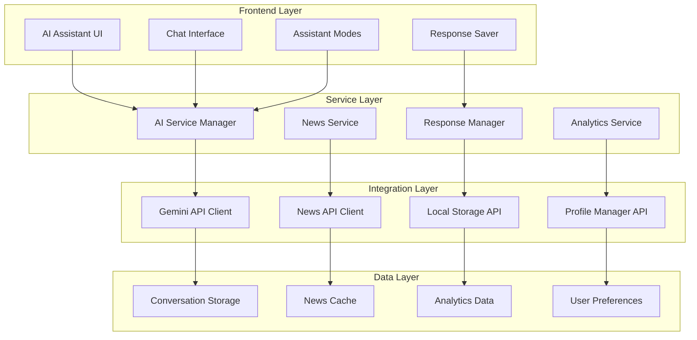

# AI Assistant Integration Design Document

## Overview

This design document outlines the architecture and implementation approach for integrating a Gemini API-powered AI assistant into the existing UPSC learning platform. The AI assistant will provide personalized learning support, real-time news analysis, performance analytics, and adaptive study recommendations while maintaining seamless integration with the current platform architecture.

## Architecture

### High-Level Architecture



### Component Integration

The AI assistant will integrate with existing platform components:

- **ProfileManager**: For user preferences and study data
- **PerformanceOptimizer**: For real-time analytics processing
- **ValidationSystem**: For input sanitization and security
- **ErrorHandler**: For robust error management
- **LoadingStateManager**: For UI state management

## Components and Interfaces

### 1. AI Service Manager

**Purpose**: Central orchestrator for all AI-related operations

**Key Methods**:
```javascript
class AIServiceManager {
  constructor(apiKey, config)
  
  // Core conversation methods
  async sendMessage(message, context, mode)
  async getResponse(conversationId)
  setMode(mode) // 'general', 'mcq', 'essay', 'news'
  
  // Context management
  addContext(type, data)
  clearContext()
  getConversationHistory(limit)
  
  // Integration methods
  async analyzePerformance(userData)
  async generateRecommendations(analyticsData)
  async summarizeNews(articles)
}
```

**Configuration**:
```javascript
const aiConfig = {
  apiKey: process.env.GEMINI_API_KEY,
  model: 'gemini-pro',
  maxTokens: 2048,
  temperature: 0.7,
  contextWindow: 10,
  rateLimiting: {
    requestsPerMinute: 60,
    requestsPerHour: 1000
  }
}
```

### 2. Gemini API Client

**Purpose**: Direct interface with Google's Gemini API

**Key Methods**:
```javascript
class GeminiAPIClient {
  constructor(apiKey, config)
  
  async generateContent(prompt, options)
  async generateStreamContent(prompt, options)
  validateResponse(response)
  handleRateLimit()
  
  // Error handling
  retryRequest(request, maxRetries)
  handleAPIError(error)
}
```

**Request Structure**:
```javascript
const requestPayload = {
  contents: [{
    parts: [{
      text: enhancedPrompt
    }]
  }],
  generationConfig: {
    temperature: 0.7,
    topK: 40,
    topP: 0.95,
    maxOutputTokens: 2048
  },
  safetySettings: [
    {
      category: "HARM_CATEGORY_HARASSMENT",
      threshold: "BLOCK_MEDIUM_AND_ABOVE"
    }
  ]
}
```

### 3. News Integration Service

**Purpose**: Fetch, process, and analyze UPSC-relevant news

**Key Methods**:
```javascript
class NewsIntegrationService {
  constructor(newsAPIs, aiService)
  
  async fetchLatestNews(categories, limit)
  async summarizeArticle(article)
  async categorizeNews(articles)
  async analyzeRelevance(article, examContext)
  
  // Caching and optimization
  getCachedNews(timeframe)
  updateNewsCache()
  scheduleNewsUpdates()
}
```

**News Sources Integration**:
- News API (newsapi.org)
- RSS feeds from major Indian news outlets
- Government press releases
- Educational news sources

### 4. Response Manager

**Purpose**: Handle saving and organizing AI responses

**Key Methods**:
```javascript
class ResponseManager {
  constructor(storageManager)
  
  saveResponse(response, metadata)
  categorizeResponse(response, category)
  searchSavedResponses(query, filters)
  exportResponses(format)
  
  // Integration with learn page
  addToNotesSection(response, noteId)
  addToFlashcards(response, deckId)
  createStudyMaterial(response, type)
}
```

**Response Metadata Structure**:
```javascript
const responseMetadata = {
  id: 'unique-id',
  timestamp: '2024-01-01T00:00:00Z',
  mode: 'general',
  category: 'notes', // 'notes', 'flashcards', 'mcqs'
  tags: ['physics', 'mechanics'],
  userRating: 5,
  savedToSection: 'learn-notes',
  conversationContext: 'conversation-id'
}
```

### 5. Performance Analytics Integration

**Purpose**: Analyze user data and generate insights

**Key Methods**:
```javascript
class PerformanceAnalyticsAI {
  constructor(aiService, performanceOptimizer)
  
  async analyzeStudyPatterns(userData)
  async identifyWeakAreas(performanceData)
  async generateDailyTasks(userProfile, goals)
  async predictPerformance(currentTrends)
  
  // Real-time analysis
  processSessionData(sessionData)
  updateRecommendations(newData)
  generateInsights(timeframe)
}
```

### 6. Assistant Mode Manager

**Purpose**: Handle different AI assistant modes and contexts

**Key Methods**:
```javascript
class AssistantModeManager {
  constructor()
  
  setMode(mode, context)
  getPromptTemplate(mode)
  validateModeTransition(fromMode, toMode)
  
  // Mode-specific handlers
  handleMCQMode(question, options, userAnswer)
  handleEssayMode(topic, userEssay)
  handleNewsMode(article, analysisType)
  handleGeneralMode(query, context)
}
```

**Mode Configurations**:
```javascript
const modeConfigs = {
  general: {
    systemPrompt: "You are a helpful UPSC preparation assistant...",
    temperature: 0.7,
    maxTokens: 1024
  },
  mcq: {
    systemPrompt: "You are an expert at explaining MCQ solutions...",
    temperature: 0.3,
    maxTokens: 512,
    responseFormat: "structured"
  },
  essay: {
    systemPrompt: "You are an essay evaluation expert...",
    temperature: 0.5,
    maxTokens: 2048,
    responseFormat: "detailed_feedback"
  },
  news: {
    systemPrompt: "You analyze current affairs for UPSC relevance...",
    temperature: 0.4,
    maxTokens: 1024,
    responseFormat: "summary_analysis"
  }
}
```

## Data Models

### 1. Conversation Model

```javascript
const conversationSchema = {
  id: 'string',
  userId: 'string',
  mode: 'string', // 'general', 'mcq', 'essay', 'news'
  messages: [{
    id: 'string',
    role: 'string', // 'user', 'assistant'
    content: 'string',
    timestamp: 'datetime',
    metadata: {
      tokens: 'number',
      processingTime: 'number',
      confidence: 'number'
    }
  }],
  context: {
    subject: 'string',
    topic: 'string',
    difficulty: 'string',
    userGoals: 'array'
  },
  createdAt: 'datetime',
  updatedAt: 'datetime',
  isActive: 'boolean'
}
```

### 2. News Article Model

```javascript
const newsArticleSchema = {
  id: 'string',
  title: 'string',
  content: 'string',
  summary: 'string', // AI-generated
  source: {
    name: 'string',
    url: 'string',
    credibility: 'number'
  },
  category: 'string', // 'polity', 'economics', 'geography', etc.
  upscRelevance: {
    score: 'number', // 1-10
    subjects: 'array',
    topics: 'array',
    examImportance: 'string' // 'high', 'medium', 'low'
  },
  publishedAt: 'datetime',
  analyzedAt: 'datetime',
  tags: 'array'
}
```

### 3. Saved Response Model

```javascript
const savedResponseSchema = {
  id: 'string',
  conversationId: 'string',
  content: 'string',
  category: 'string', // 'notes', 'flashcards', 'mcqs'
  metadata: {
    mode: 'string',
    subject: 'string',
    topic: 'string',
    difficulty: 'string',
    userRating: 'number',
    usefulness: 'number'
  },
  savedToSection: 'string', // learn page section
  tags: 'array',
  createdAt: 'datetime',
  lastAccessed: 'datetime'
}
```

### 4. Analytics Insight Model

```javascript
const analyticsInsightSchema = {
  id: 'string',
  userId: 'string',
  type: 'string', // 'weakness', 'strength', 'recommendation', 'prediction'
  insight: 'string',
  confidence: 'number',
  actionable: 'boolean',
  recommendations: [{
    action: 'string',
    priority: 'string', // 'high', 'medium', 'low'
    estimatedImpact: 'number',
    timeframe: 'string'
  }],
  dataSource: {
    type: 'string',
    timeframe: 'string',
    sampleSize: 'number'
  },
  generatedAt: 'datetime',
  validUntil: 'datetime'
}
```

## Error Handling

### Error Categories and Responses

1. **API Errors**:
   - Rate limiting: Queue requests and retry with exponential backoff
   - Authentication: Refresh tokens and retry
   - Service unavailable: Fallback to cached responses

2. **Content Errors**:
   - Inappropriate content: Filter and sanitize responses
   - Incomplete responses: Request regeneration
   - Context loss: Rebuild context from conversation history

3. **Integration Errors**:
   - Storage failures: Use temporary storage and retry
   - News API failures: Use cached news data
   - Performance data errors: Use default recommendations

### Error Recovery Strategies

```javascript
class AIErrorHandler extends ErrorHandler {
  constructor() {
    super();
    this.retryStrategies = new Map();
    this.fallbackResponses = new Map();
  }
  
  async handleAPIError(error, context) {
    switch (error.type) {
      case 'RATE_LIMIT':
        return this.handleRateLimit(error, context);
      case 'AUTHENTICATION':
        return this.handleAuthError(error, context);
      case 'CONTENT_FILTER':
        return this.handleContentFilter(error, context);
      default:
        return this.handleGenericError(error, context);
    }
  }
  
  async handleRateLimit(error, context) {
    const delay = this.calculateBackoffDelay(context.retryCount);
    await this.delay(delay);
    return this.retryRequest(context);
  }
}
```

## Testing Strategy

### Unit Testing

1. **AI Service Manager Tests**:
   - Message processing and response handling
   - Context management and conversation flow
   - Mode switching and configuration

2. **API Client Tests**:
   - Request formatting and response parsing
   - Error handling and retry logic
   - Rate limiting and authentication

3. **Integration Tests**:
   - End-to-end conversation flows
   - News processing and summarization
   - Response saving and retrieval

### Performance Testing

1. **Load Testing**:
   - Concurrent user conversations
   - API rate limit handling
   - Memory usage optimization

2. **Response Time Testing**:
   - API response times under load
   - UI responsiveness during processing
   - Cache performance optimization

### Security Testing

1. **Input Validation**:
   - Prompt injection prevention
   - XSS and injection attack prevention
   - Content filtering effectiveness

2. **Data Protection**:
   - Conversation data encryption
   - API key security
   - User privacy compliance

## Implementation Phases

### Phase 1: Core AI Integration (Week 1-2)
- Gemini API client implementation
- Basic conversation interface
- Response saving functionality
- Integration with existing UI

### Phase 2: News Integration (Week 3)
- News API integration
- Article summarization
- UPSC relevance analysis
- News categorization

### Phase 3: Performance Analytics (Week 4)
- User data analysis
- Personalized recommendations
- Daily task generation
- Real-time insights

### Phase 4: Advanced Features (Week 5-6)
- Multiple assistant modes
- Advanced context management
- Performance optimization
- Comprehensive testing

### Phase 5: Polish and Optimization (Week 7)
- UI/UX refinements
- Performance optimization
- Security hardening
- Documentation completion

## Security Considerations

### Data Privacy
- Conversation data stored locally only
- No sensitive user data sent to external APIs
- Configurable data retention policies
- User consent for data processing

### API Security
- Secure API key management
- Request signing and validation
- Rate limiting and abuse prevention
- Content filtering and moderation

### Input Sanitization
- Comprehensive input validation
- XSS and injection prevention
- Content filtering for inappropriate material
- Prompt injection attack prevention

## Performance Optimization

### Caching Strategy
- Response caching for common queries
- News article caching with TTL
- Context caching for conversation continuity
- Intelligent cache invalidation

### Resource Management
- Lazy loading of AI components
- Request batching and optimization
- Memory usage monitoring
- Background processing for analytics

### User Experience
- Progressive response loading
- Optimistic UI updates
- Offline capability for cached content
- Responsive design for all devices

This design provides a comprehensive foundation for implementing the AI assistant integration while maintaining compatibility with the existing platform architecture and ensuring scalability, security, and performance.